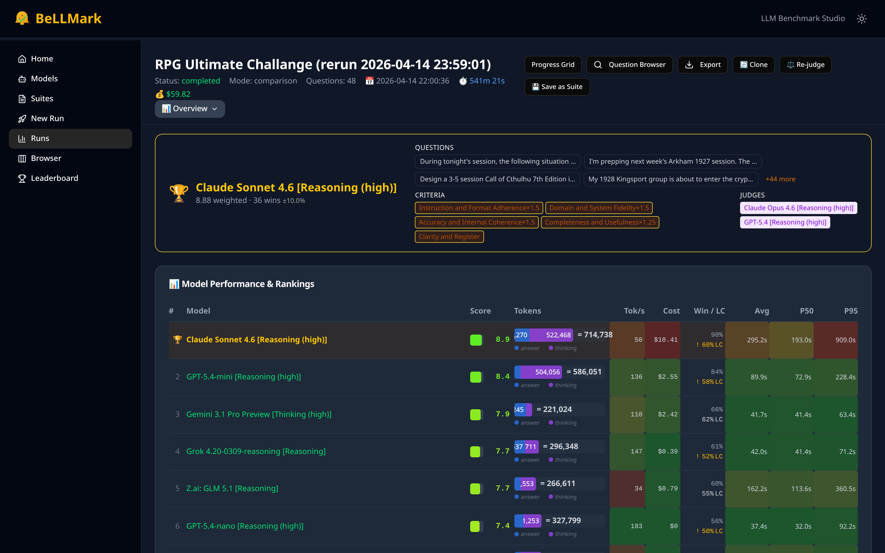
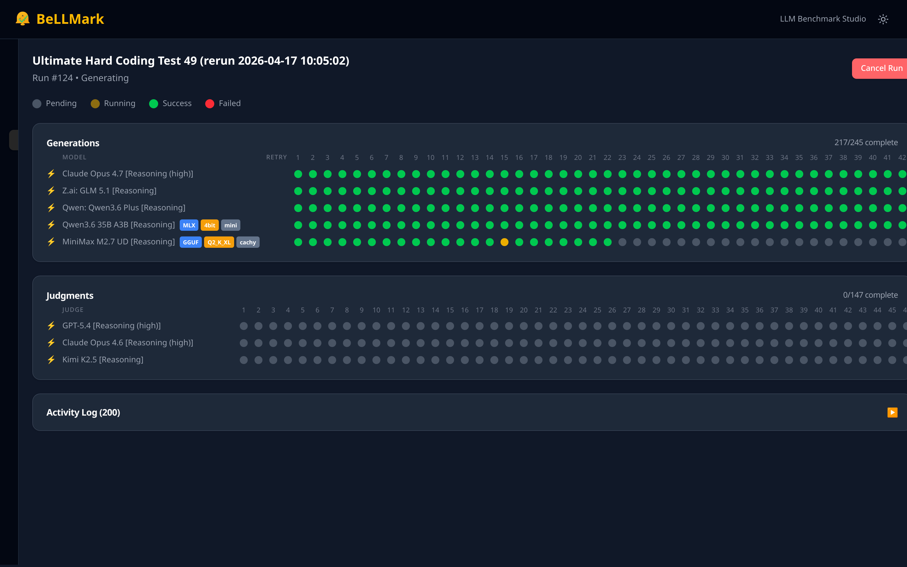
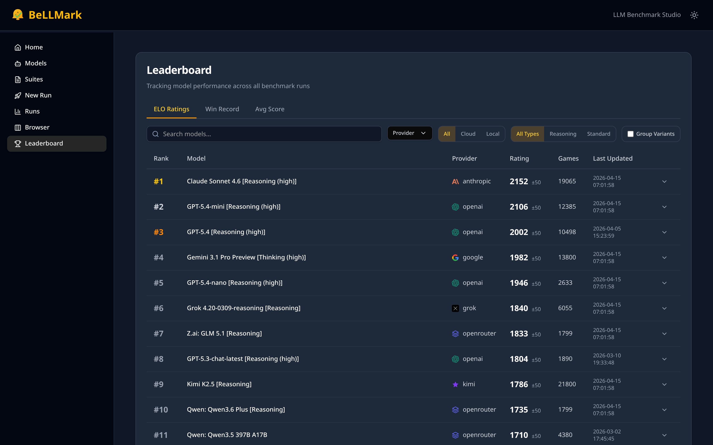
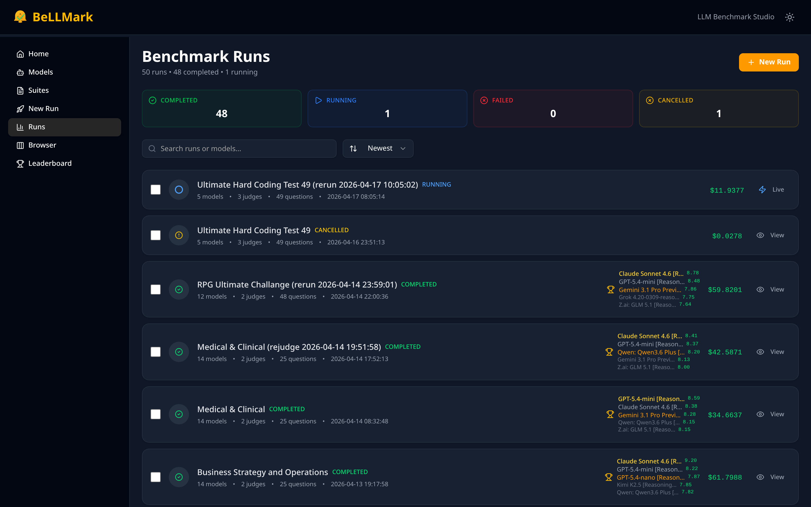
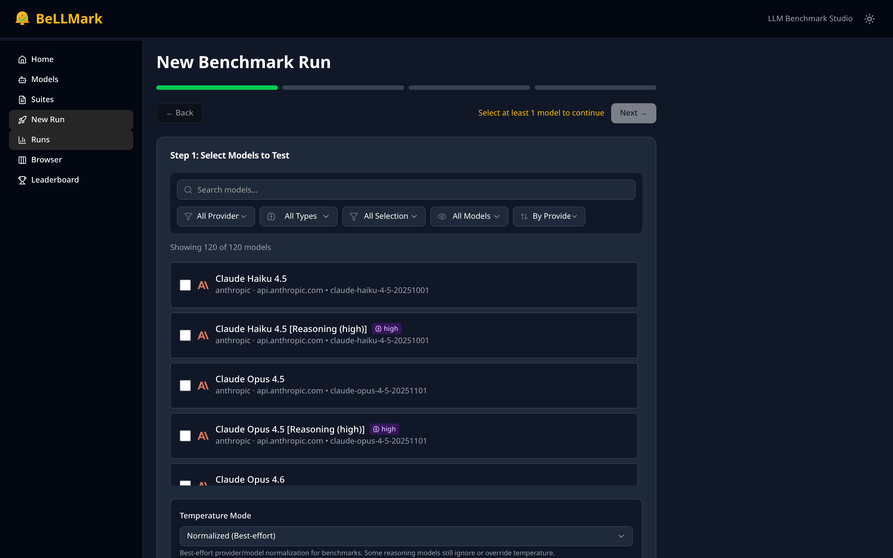

# BeLLMark

[](LICENSE)
[](https://bellmark.ai/pricing)
[](https://python.org)
[](https://react.dev)

**Self-hosted LLM evaluation studio with blind A/B/C judging and stakeholder-ready exports.**

Avoid a $20K–$150K wrong model selection decision. BeLLMark produces the defensible evaluation artifact your procurement, legal, and technical teams need — with full statistical rigor, on your own infrastructure.

---

> [!IMPORTANT]
> **BeLLMark Commercial License** — €799 one-time per legal entity.
> Introductory price: **€499** (first 60 days). [Buy License →](https://bellmark.ai/pricing)
> Free for personal and non-commercial use under PolyForm NC.

---

## Screenshots

**Results** — per-model scores, token counts, win rates, percentiles, cost, with blind-label mapping revealed.


**Live progress** — per-question, per-model status grid over WebSocket. Retries, failures, and quant breakdowns (here: MiniMax at Q2_K_XL stumbling on hard coding problems) are visible in real time.


**Global ELO leaderboard** — ratings across all runs, with provider, reasoning-mode, and cloud/local filters.


**Benchmark runs dashboard** — status cards (completed / running / failed / cancelled), cost totals, top models per run.


**New benchmark wizard** — model selection, judge configuration, criteria panel, comparison vs. separate modes.


---

## Why BeLLMark

| Without BeLLMark | With BeLLMark |
|---|---|
| Gut-feel model selection | Statistically defensible ranking |
| Vendor-supplied benchmarks | Your tasks, your criteria, your data |
| Evaluation takes weeks | Benchmark runs in minutes |
| Results locked in SaaS | Self-hosted — your database, config, and exports stay on your infrastructure (cloud LLM calls go direct to the provider you pick, never through BeLLMark) |
| Slides with no methodology | Exportable PDF/PPTX with bias diagnostics |

---

## Key Features

**Evaluation**
- Blind A/B/C/D/E/F comparison — responses shuffled and labeled anonymously, bias mapping revealed in results
- Compare 1–6 models per run with any model as judge
- Separate mode for independent absolute scoring alongside comparison mode
- AI-generated evaluation criteria from a topic description
- File attachments as shared context for all models (images, text)

**Statistical Rigor**
- Wilson score confidence intervals for win rates
- Bootstrap confidence intervals for score differences
- Cohen's d effect sizes and Wilcoxon signed-rank tests
- Holm-Bonferroni multiple comparison correction
- Friedman test for multi-model rankings
- Length-controlled win rates (verbosity bias correction)
- Self-preference bias detection (Mann-Whitney U)
- Verbosity bias detection (Spearman correlation)
- ICC inter-rater reliability for multi-judge consistency
- Statistical power analysis

**Infrastructure**
- Real-time WebSocket progress with detailed activity log
- Smart retry — automatic exponential backoff (2 s, 5 s, 10 s), up to 3 attempts
- Checkpoint recovery before phase transitions (generation → judging)
- ELO rating system with Bayesian adaptive K-factor and global leaderboard
- Cross-run comparison and prompt suite management
- Fernet encryption for API keys at rest
- SQLite database, zero external services required

**Providers** — 9 supported (see [Provider Support](#provider-support))

**Exports** — 5 formats (see [Export Formats](#export-formats))

---

## Statistical Methodology

BeLLMark applies peer-reviewed statistical methods to every benchmark run to ensure results are auditable and free from common LLM evaluation artifacts.

| Method | Purpose |
|---|---|
| Blind evaluation (randomized label mapping) | Eliminates presentation-order position bias |
| Wilson score CI | Reliable win-rate confidence intervals at low sample sizes |
| Bootstrap CI | Score difference confidence intervals without normality assumptions |
| Cohen's d | Standardized effect size — "is the difference practically meaningful?" |
| Wilcoxon signed-rank test | Non-parametric pairwise significance without normality assumption |
| Holm-Bonferroni correction | Controls family-wise error rate across multiple model comparisons |
| Friedman test | Omnibus significance test for k > 2 model rankings |
| Length-controlled win rates | Removes verbosity inflation from win-rate calculations |
| Mann-Whitney U (self-preference) | Detects whether a judge systematically favors its own provider's models |
| Spearman correlation (verbosity) | Quantifies correlation between response length and score |
| ICC (inter-rater reliability) | Measures consistency when multiple judges are used |
| Statistical power analysis | Reports whether sample size was sufficient to detect the observed effect |

**Result**: every export includes a methodology appendix explaining which tests were run and what the results mean, suitable for technical reviewers or procurement committees.

---

## Quick Start

```bash
git clone https://github.com/Context-Management/BeLLMark.git
cd BeLLMark
cp .env.example .env
# Edit .env with your API keys and BELLMARK_SECRET_KEY
./start.sh
```

Open **http://localhost:5173**

The startup script installs Python and Node dependencies automatically on first run and checks for minimum versions. See [Deployment Guide](docs/deployment.md) for Docker, reverse proxy, and production options.

**Minimum requirements**: Python 3.11+, Node 18+, 512 MB RAM.

---

> [!WARNING]
> **Do not expose BeLLMark to the public internet without authentication.**
> v1 has optional API key auth (`BELLMARK_API_KEY`). For network access, use VPN, reverse proxy with auth, or a firewall rule restricting access to trusted IPs.
> See [Deployment Guide](docs/deployment.md).

---

## Export Formats

| Format | Best For |
|---|---|
| **HTML** | Self-contained stakeholder report — charts, methodology appendix, full response text. Single file, no server required. |
| **PDF** | Formal deliverable for procurement, legal, or executive review. Paginated, print-ready. |
| **PPTX** | Executive slide deck with charts and summary tables. Ready to drop into a presentation. |
| **CSV** | Spreadsheet-compatible export for custom analysis, pivot tables, or data archival. |
| **JSON** | Machine-readable full data dump — all scores, metadata, statistical results. Suitable for downstream analysis or audit trails. |

---

## Provider Support

| Provider | Type | Notes |
|---|---|---|
| **OpenAI** | Cloud | GPT-4o, o1, o3, GPT-4.5, and all OpenAI chat models |
| **Anthropic** | Cloud | Claude Opus, Sonnet, Haiku (all generations) |
| **Google** | Cloud | Gemini Pro, Flash, Ultra |
| **Mistral** | Cloud | Mistral Large, Small, Codestral |
| **DeepSeek** | Cloud | DeepSeek-V3, DeepSeek-R1 reasoning models |
| **Grok** | Cloud | xAI Grok models |
| **GLM** | Cloud | Zhipu GLM-4 series |
| **Kimi** | Cloud | Moonshot Kimi models |
| **LM Studio** | Local | Any GGUF model on your machine, or any OpenAI-compatible endpoint |

All API keys are encrypted at rest using Fernet symmetric encryption. Keys are never logged or transmitted to third parties.

---

## Pricing

BeLLMark is a **one-time purchase** — no subscriptions, no seat limits, no usage fees.

| Tier | Price | Who It's For |
|---|---|---|
| **Personal / Non-commercial** | Free | Individuals, researchers, open-source projects (PolyForm NC) |
| **Commercial — Introductory** | €499 one-time | First 60 days from launch |
| **Commercial — Standard** | €799 one-time | Per legal entity, unlimited seats, unlimited runs |

**How BeLLMark compares to subscription alternatives** (as of April 2026):

| Alternative | Typical Cost | BeLLMark |
|---|---|---|
| Promptfoo Team | $50/month ($600/year) | €799 one-time |
| LangSmith Plus | $39/seat/month ($468/seat/year) | €799 one-time |
| Confident AI Premium | $49.99/seat/month ($600/seat/year) | €799 one-time |
| Braintrust Pro | $249/month (~$2,988/year) | €799 one-time |

One commercial license covers your entire organization — all teams, all projects, all runs. Your data stays on your infrastructure. [Buy License →](https://bellmark.ai/pricing)

**Payments** are processed by [Creem](https://creem.io) (EU-based Merchant of Record, registered in Estonia). Creem handles VAT/sales tax globally and issues your invoice directly — BeLLMark never sees your payment details. You receive a purchase receipt by email which serves as your license proof.

**No lock-in, no subscription traps.** BeLLMark runs entirely on your infrastructure. Your license is permanent. If the project is ever discontinued, your installation keeps working — there is no license server to check in with, no cloud service to shut down, no vendor dependency. The PolyForm NC license guarantees your right to continue non-commercial use of any released version in perpetuity.

---

## FAQ

**Q: What counts as "commercial use"?**
Any use by a for-profit entity, any use that supports a commercial product, service, or workflow, or any internal use within a company. Non-commercial use (personal research, hobby projects, non-profit organizations, educational institutions) is free under PolyForm NC.

**Q: Does one license cover my whole company?**
Yes. A commercial license is per legal entity, not per seat or per user. One purchase covers all employees and all projects within that entity.

**Q: Can I run BeLLMark on an air-gapped or offline machine?**
Yes. BeLLMark has no telemetry and requires no outbound connection to function. Connect only to the model provider APIs you configure. Local models via LM Studio work fully offline.

**Q: Is there a trial period?**
The free PolyForm NC license is effectively unlimited for non-commercial evaluation. If you need to evaluate BeLLMark for a commercial purchase decision, this covers individual testing. Contact [support@bellmark.ai](mailto:support@bellmark.ai) if you have specific procurement requirements.

**Q: What happens if I need a refund?**
Refunds are available within 30 days of purchase if BeLLMark does not function as described. Contact [support@bellmark.ai](mailto:support@bellmark.ai) with your order details.

---

## Support

| Channel | Use For |
|---|---|
| [GitHub Issues](https://github.com/Context-Management/BeLLMark/issues) | Bugs, installation problems, feature requests |
| [support@bellmark.ai](mailto:support@bellmark.ai) | Licensing, refunds, procurement, security reports |

See [SUPPORT.md](SUPPORT.md) for the Minimum Reproducible Bundle format required for bug reports.

---

## License

**Free use**: [PolyForm Noncommercial License 1.0.0](LICENSE) — personal use, research, education, non-profit organizations, and non-commercial hobby projects.

**Commercial use**: [€799 one-time commercial license](https://bellmark.ai/pricing) per legal entity. Required for any for-profit use, internal business tooling, or client-facing work.

Copyright 2026 BeLLMark (https://bellmark.ai)
